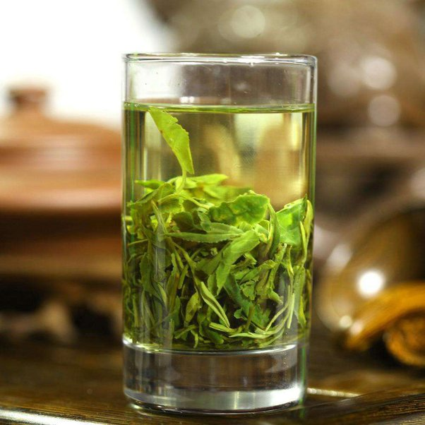

<html lang="en">
<head>
    <meta charset="UTF-8">
    <meta name="viewport" content="width=device-width, initial-scale=1.0">
    <title>Green Tea</title>
    
</head>
<body>
    

        <h1></h1>
        <h2>A quick and easy-to-understand guide to green tea</h2>
        
There are many types of tea from around the world, but by far the best (1penny) is green tea. And with so many varieties and types there are countless expectations of how to brew and steep and even how to handle them. But this will be your go-to quick and easy basic guide for all things tea! (well...the green anyways) 

        
Brewing times and temperatures:

        <ol>
            <li>for a basic green tea, such as Sencha, the water should be heated to at least 175F or 180F</li>
            <li>but there are a few, such as Gyokuro, which are meant to drink at a lower temperature, such as 140F</li>
        </ol>
        
Now while you are free to use whatever method you prefer to heat your water with. The best way to have an unaltered flavor is to use a kettle. But you can achieve the same result by boiling the water in a pot on your stove. You can use a microwave in a pinch, but this affects the liquid since it heats up much faster instead of at a more uniform pace. Essentially, the water molecules heat up too fast, altering the water's taste.

        <h3>Things to remember</h3>
        <ul>
            <li>Loose Leaf: by letting the leaves freely float around the water (heated), the leaves can release their flavor, nutrients, and caffeine much easier and freely. This allows for a much deeper experience from your tea. Remember to strain or separate the leaves from the liquid before drinking. (though if you like that sort of stuff....who am I to say otherwise) </li>
            <li>Tea Bag: the most common way to experience tea is by holding leaves in a little cloth bag. It offers the chance to release the flavors and nutrients the same way as loose leaves, though the number of leaves can be restricted, which can reduce the flavor and the tea bag itself can also alter the taste. On a bonus point, though, easy clean up! </li>
        </ul>
        <h4>That is a tea field....pretty right? With tea g brown all over the world its amazing how vastly different they are not only grown, but picked, dried and stored as well!</h4>
        
        <!-- Navigation Menu -->
        <ul>
            <li><a href="https://kenzie-nice.github.io/Losingtrack_of_theseSites.io/">Home Page</a></li>
            <li><a href="https://kenzie-nice.github.io/Contactpage.io/">Contact Us!</a></li>
            <li><a href="https://kenzie-nice.github.io/About-us.io/">About Us!</a></li>
        </ul>
    

</body>
</html>

